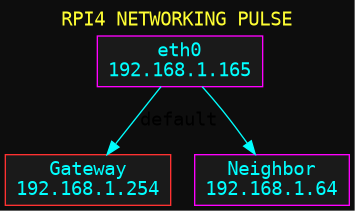

# RPI4 Neon Diagnostics 🌌

A high-visibility, dark-neon diagnostic suite for Raspberry Pi 4. This project automates the generation of Graphviz-based system visualizations and hosts them via a self-contained interactive Mission Control dashboard.

## 🚀 Features
- **Neon Aesthetic:** High-contrast diagrams optimized for dark mode.
- **Mission Control Dashboard:** Toggle between static "Gallery" view and a live interactive D3-Graphviz viewer.
- **Self-Contained:** All libraries (D3, WASM Graphviz) are hosted locally on the node.
- **Automated Pulse:** Re-generates diagrams on service start and via cron (every 15 mins).
- **Systemd Integration:** Runs as a persistent background service on port \`8888\`.
- **MOTD Integration:** Dashboard links injected into the SSH login banner.

## 📂 Repository Structure
- **\`src/\`**: Automation scripts (\`generate_diagrams.sh\`).
- **\`assets/lib/\`**: Localized JS/WASM libraries (D3, Graphviz).
- **\`assets/\`**: Rendered static visuals (\`.png\`, \`.svg\`).
- **\`docs/diagrams/\`**: Graphviz source files (\`.dot\`).
- **\`docs/\`**: Conditioning reports and [Lessons Learned](docs/LESSONS_LEARNED.md).
- **[The Journey](docs/JOURNEY.md)**: Narrative timeline of the project.
- **[Troubleshooting](docs/TROUBLESHOOTING.md)**: Quick fixes for common issues.
- **\`systemd/\`**: Linux service configuration.
- **\`motd/\`**: SSH banner configuration.

## 📊 Visualizations Included
1. **Networking Pulse:** Real-time topology and ARP neighbor map.
2. **System Vitals:** CPU load, RAM usage, Disk health, and Thermal status.
3. **Active Armada:** Service and port mapping (Nginx, Tor, Go2RTC, etc.).
4. **The Story So Far:** Uptime and continuity tracking.
5. **Blueprint Layout:** Core \`/etc\` configuration directory mapping.
6. **Service Flow:** Internal logic of the diagnostic system itself.
7. **Repo Structure:** Architectural overview of this project.
8. **Conditioning Chain:** Visual history of node preparation.

---
*Generated with ⚡ by Gemini CLI*
